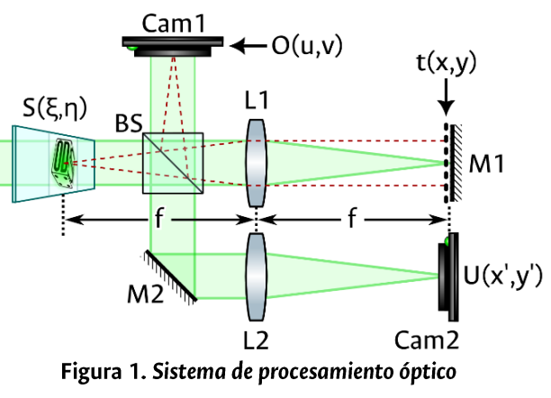

# Actividad 1: 💻 Simulación y Análisis de un Procesador Óptico 🔍

Analizaremos el sistema de procesamiento óptico presentado en la siguiente figura.

## Descripción del Sistema Óptico

El sistema se basa en un interferómetro de Mach-Zehnder modificado que procesa la información de un objeto bidimensional `S(ξ,η)`. La luz coherente (λ = 633 nm) que atraviesa el objeto se divide en dos brazos:

* **Trayectoria 1 (Brazo superior):** La luz transmitida atraviesa la lente L1, se refleja en un **espejo con reflectancia variable** M1, vuelve a pasar por L1 y finalmente se refleja en el divisor de haz (BS) hacia la **Cámara 1**. El campo resultante en esta cámara es `O(u,v)`. Esta configuración sugiere una operación de filtrado o correlación espacial.

* **Trayectoria 2 (Brazo inferior):** La luz reflejada por el BS es redirigida por el espejo M2, atraviesa la lente L2 y se propaga hasta la **Cámara 2**, formando el campo `U(x',y')`. Esta trayectoria corresponde a un sistema de formación de imagen o de difracción.
